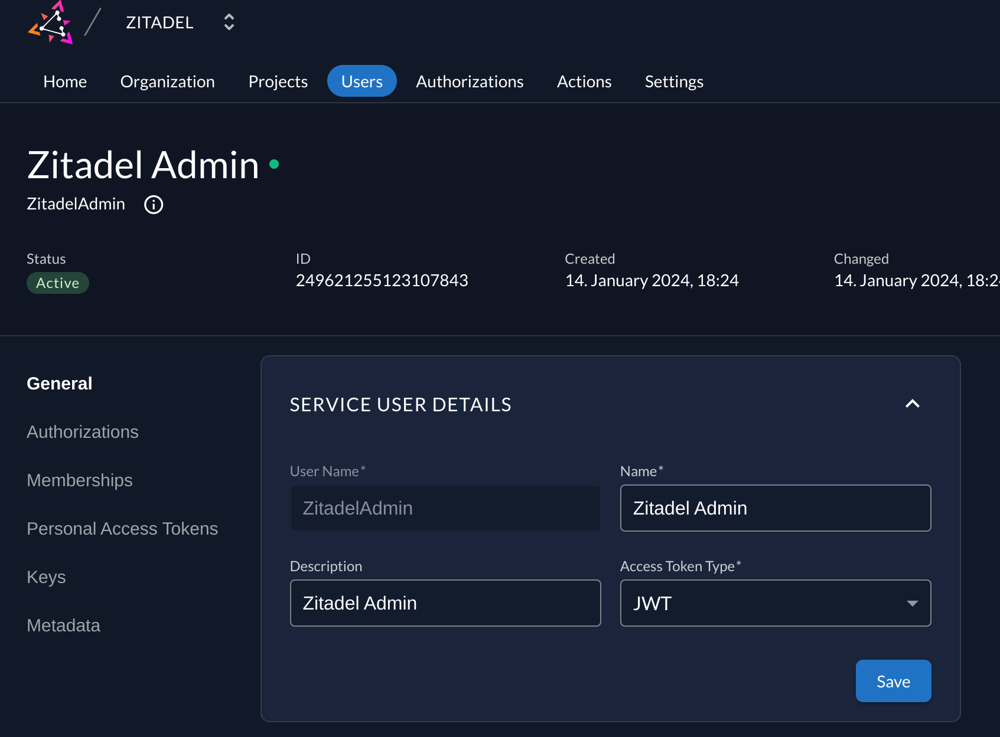
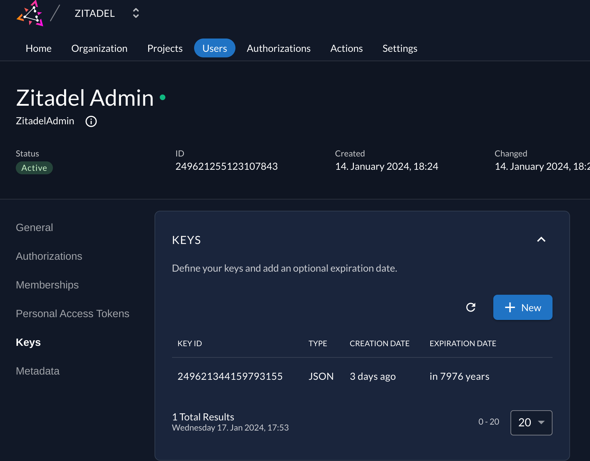
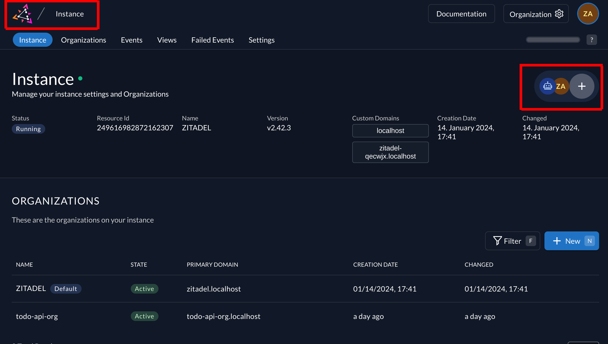
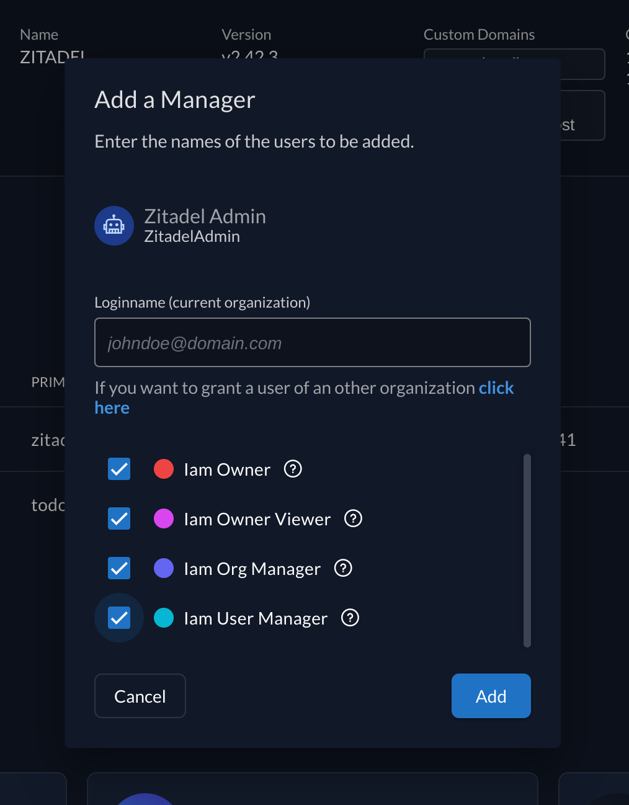

## Setup for Terraform

1. Create a Service User 
1. Create a key and download   Save as `admin-key.json` in the `terraform` folder
1. Add Service user as manager:
    * Step 1 - 
    * Step 2 - 